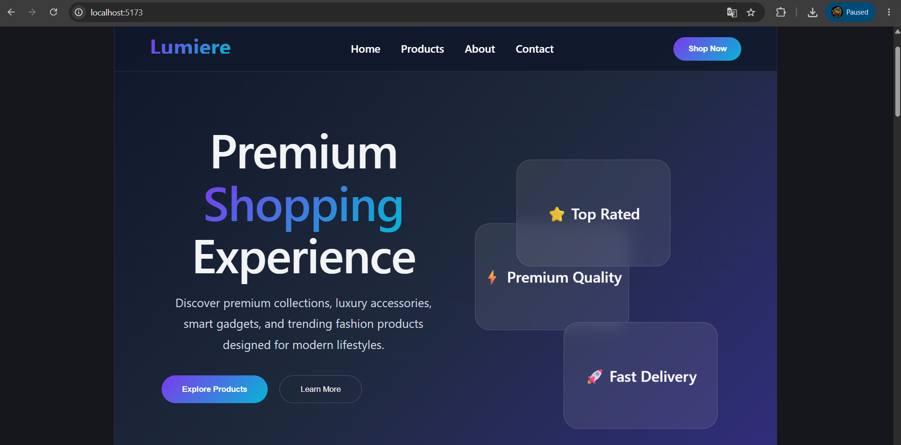
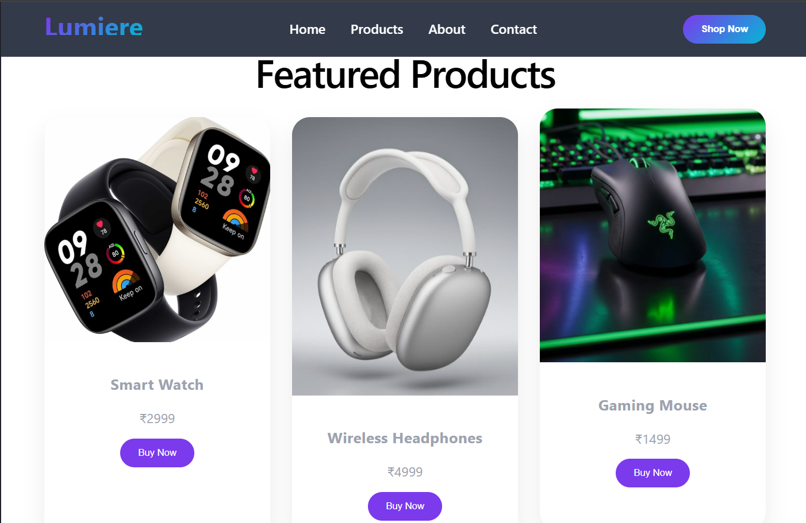
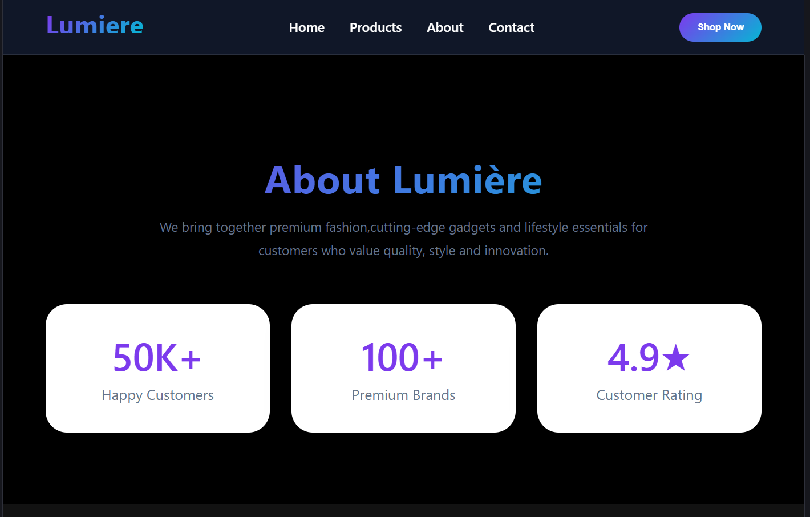
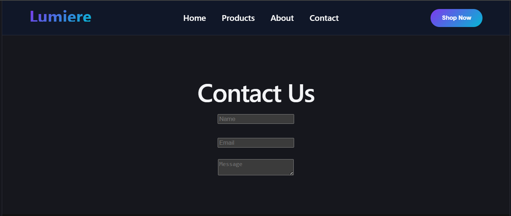

# 🛍️ Lumiere Store

A modern **React + Vite e-commerce UI project** built with reusable components and React Router for smooth multi-page navigation.  
It focuses on clean UI design, responsiveness, and a structured frontend architecture.

---

## 🚀 Live Demo
Not deployed yet

---

## 📸 Project Screenshots

### 🏠 Home Page

### 🛒 Products Page

### ℹ️ About Page

### 📞 Contact Page

---

## 🧰 Tech Stack

- ⚛️ React.js
- ⚡ Vite
- 🌐 React Router DOM
- 🎨 CSS3
- 📦 Node.js + npm

---

## ✨ Features

- 🧭 Multi-page navigation using React Router
- 📱 Fully responsive design
- ♻️ Reusable components (Navbar, Footer)
- ⚡ Fast performance with Vite
- 🎨 Modern UI design
- 🛒 E-commerce layout structure

---

## 📁 Project Structure
Lumiere-store/
│
├── public/
│   └── vite.svg
│
├── src/
│   │
│   ├── assets/              # Images, icons, logos
│   │   ├── logo.png
│   │   └── hero.jpg
│   │
│   ├── components/         # Reusable UI components
│   │   ├── Navbar.jsx
│   │   ├── Footer.jsx
│   │   └── ProductCard.jsx (optional)
│   │
│   ├── pages/              # All route pages
│   │   ├── Home.jsx
│   │   ├── About.jsx
│   │   ├── Products.jsx
│   │   └── Contact.jsx
│   │
│   ├── routes/             # (optional but clean structure)
│   │   └── AppRoutes.jsx
│   │
│   ├── App.jsx            # Main app layout + routes
│   ├── main.jsx           # Entry point
│   └── index.css          # Global styles
│
├── screenshots/           # README images
│   ├── home.png
│   ├── products.png
│   ├── about.png
│   └── contact.png
│
├── package.json
├── vite.config.js
└── README.md